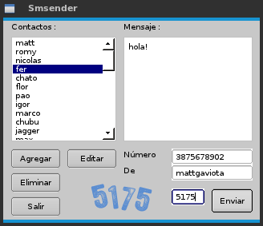

Descripción
-----------

Programa para enviar sms usando la interfaz web de Personal (proveedor argentino de telefonia celular).
Permite manejar contactos, para un uso mas rápido y accesible.

Uso
---

Para usarlo, ejecutar desde una consola::

	python smsenderqt.py	

Contactos
=========

Para agregar un nuevo contacto, pulsa *Agregar*, para editar un contacto existente
pulsa *Editar* y para eliminar un contacto pulsa *Eliminar*.
Los contactos se almacenan en la carpeta *HOME* del usuario, en un archivo oculto
denominado *.contactos*.

Mensaje y número
================

El mensaje acepta 200 caracteres incluyendo el destinatario (90 más que la página!) y
detecta errores comunes de envío.
El número ingresado tiene que tener 10 caracteres. Por ejemplo::

    Si el número es de Salta y es 154567890 tendrías que escribir 3874567890

Screenshots
===========

Requisitos
----------

  * pyqt4
  * python-twill
  * python-urllib
  * python-simplejson

Colaborar
---------

Puedes clonar el proyecto usando el comando::

    git clone http://github.com/mattgaviota/SMS.git

reportar errores o features requeridas en esta misma pagina.
